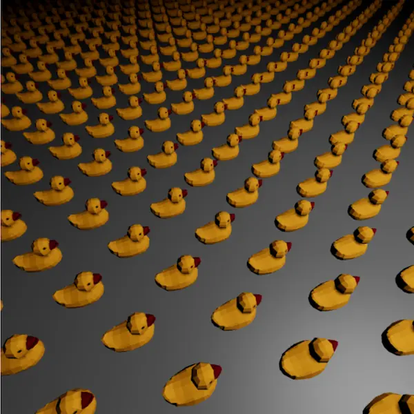

# Instanced Ducks

A grid of instanced gltf model ducks. [Fork on Codesandbox](https://githubbox.com/onion2k/r3f-by-example/tree/develop/examples/geometry/instanced-ducks)

## Code

```js
import * as THREE from "three";
import React, { Suspense, useRef } from "react";
import ReactDOM from "react-dom";
import { Canvas, useFrame } from "react-three-fiber";
import { OrbitControls, Stats, Plane } from "@react-three/drei";
import Duck from "./duck";
import "./styles.css";

const tempDucks = new THREE.Object3D();

const Ducks = ({ i, j }) => {
  const { geometry, material } = Duck();

  const ref = useRef();

  useFrame(({ clock }) => {
    let counter = 0;
    const t = clock.oldTime * 0.001;
    for (let x = 0; x < i; x++) {
      for (let z = 0; z < j; z++) {
        const id = counter++;
        tempDucks.position.set(i / 2 - x, 0, j / 2 - z);
        tempDucks.rotation.y = t;
        tempDucks.updateMatrix();
        ref.current.setMatrixAt(id, tempDucks.matrix);
      }
    }
    ref.current.instanceMatrix.needsUpdate = true;
  });

  return <instancedMesh ref={ref} args={[geometry, material, i * j]} />;
};

const App = () => {
  return (
    <Canvas
      pixelRatio={1}
      style={{ height: 600, width: 600 }}
      camera={{ position: [0, 1.5, 5] }}
    >
      <pointLight
        position={[5, 5, 0]}
        intensity={1.0}
        distance={25}
        decay={2}
      />
      <Plane args={[50, 50]} rotation={[Math.PI * 1.5, 0, 0]}>
        <meshPhongMaterial color={0x808080} />
      </Plane>
      <Suspense fallback={null}>
        <Ducks i={35} j={35} />
      </Suspense>
      <OrbitControls />
      <Stats />
    </Canvas>
  );
};

ReactDOM.render(<App />, document.getElementById("root"));
```

## Screenshot


